<div align="center">

<!-- Responsive Light/Dark GitHub Banner -->
<picture>
  <source media="(prefers-color-scheme: dark)" srcset="https://capsule-render.vercel.app/api?type=waving&height=220&section=header&text=Harini%20Kashaboina&fontSize=52&fontColor=FFFFFF&fontAlignY=38&desc=MERN%20Stack%20Developer%20%7C%20Python%20Developer%20%7C%20Software%20Developer&descSize=18&descAlignY=62&animation=fadeIn&color=gradient&customColorList=0,12,20">
  <source media="(prefers-color-scheme: light)" srcset="https://capsule-render.vercel.app/api?type=waving&height=220&section=header&text=Harini%20Kashaboina&fontSize=52&fontColor=FFFFFF&fontAlignY=38&desc=MERN%20Stack%20Developer%20%7C%20Python%20Developer%20%7C%20Software%20Developer&descSize=18&descAlignY=62&animation=fadeIn&color=gradient&customColorList=0,12,20">
  
</picture>

# Hey there, I'm Harini 👋

<a href="https://git.io/typing-svg">
  
</a>

<br>

<a href="https://github.com/Harini200513">
  
</a>
<a href="https://github.com/Harini200513?tab=repositories">
  
</a>


</div>

---

## 👩‍💻 About Me

<table>
<tr>
<td width="65%" valign="middle">

I'm a **2026 Computer Science and Engineering graduate** interested in software development and building practical, user-focused applications.

- 💻 Focused on **MERN Stack Development** and **Python**
- 🚀 Interested in full-stack web application development
- 🧠 Exploring machine learning and modern developer technologies
- 🛠️ Experienced in building full-stack and Python-based projects
- 📚 Continuously improving my technical and problem-solving skills
- 🎯 Open to **fresher software development opportunities**

I enjoy turning ideas into useful applications while continuously learning better ways to design, build, and improve software.

</td>

</tr>
</table>

---

## 🛠️ Tech Stack

<div align="center">

### 💻 Languages


### 🎨 Frontend


### ⚙️ Backend


<p>
  
</p>

### 🗄️ Databases


### 🤖 Machine Learning


<p>
  
  
  
  
  
</p>

### ☁️ Cloud & Tools


</div>
---

# 🚀 Featured Projects

<div align="center">

<table>
<tr>
<td width="33%" valign="top">

<h3 align="center">Digital Civic Engagement Platform</h3>

<p align="center">
  
</p>

<p>
A full-stack web platform designed to support <strong>digital civic engagement and interaction</strong>, providing a practical web-based environment for civic participation.
</p>

<p align="center">
  <a href="[PROJECT_REPOSITORY_URL]">
    
  </a>
</p>

</td>

<td width="33%" valign="top">

<h3 align="center">Online Auction Platform</h3>

<p align="center">
  
  
</p>

<p>
A full-stack <strong>online auction application</strong> featuring user authentication and auction-related functionality, built with the MERN ecosystem and MongoDB.
</p>

<p align="center">
  <a href="[PROJECT_REPOSITORY_URL]">
    
  </a>
</p>

</td>

<td width="33%" valign="top">

<h3 align="center">Human Pose Estimation</h3>

<p align="center">
  
  
  
</p>

<p>
A computer vision project that <strong>detects and tracks human body poses</strong> using Python, OpenCV, and MediaPipe technologies.
</p>

<p align="center">
  <a href="[PROJECT_REPOSITORY_URL]">
    
  </a>
</p>

</td>
</tr>
</table>

</div>

---

## 📊 GitHub Statistics


<div align="center">





<br><br>


</div>

---

## 🐍 Contribution Snake

<div align="center">

<picture>
  <source media="(prefers-color-scheme: dark)" srcset="./profile/github-snake-dark.svg">
  <source media="(prefers-color-scheme: light)" srcset="./profile/github-snake.svg">
  
</picture>

</div>

---
# 🧠 Currently Learning

<div align="center">

| Focus Area | Current Focus |
|:---:|:---|
| ⚛️ **MERN** | Advanced MERN Stack Development |
| 🔧 **Backend** | Backend Architecture & API Development |
| ☁️ **Cloud** | AWS & Cloud Fundamentals |
| 🤖 **GenAI** | Generative AI & Modern AI/ML Technologies |
| 🧩 **Engineering** | Problem Solving & Software Engineering Practices |

</div>

---

# 🎯 Career Goals

<div align="center">

<table>
<tr>
<td>

- Start my career as a software developer
- Build scalable and useful applications
- Strengthen my full-stack development skills
- Continue learning modern technologies
- Contribute to real-world software projects
- Grow into a strong and well-rounded software engineer

</td>
</tr>
</table>

</div>

---

# 🤝 Connect With Me

<div align="center">

<a href="https://www.linkedin.com/in/harini-kashaboina-42115b2a1">
  
</a>

<a href="https://x.com/Harini_135">
  
</a>

<a href="mailto:[VERIFY_EMAIL_ADDRESS]">
  
</a>

<br><br>


<p>
  <strong>Open to learning • Building • Contributing • Growing</strong>
</p>

</div>

---

<div align="center">


</div>
```
